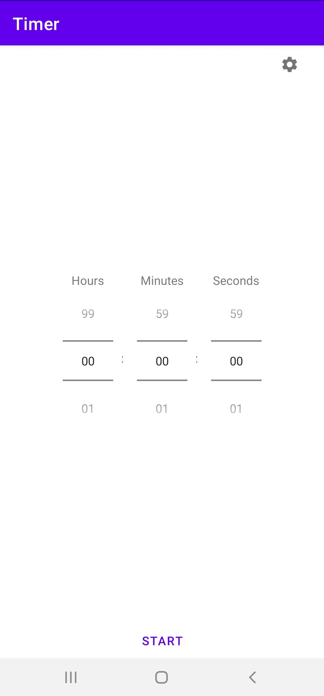
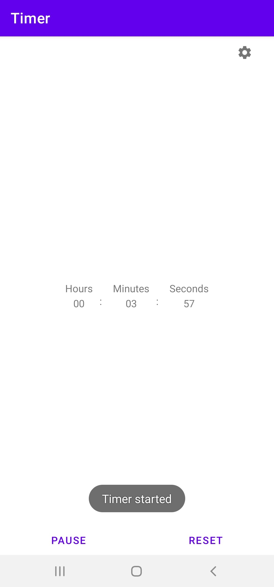
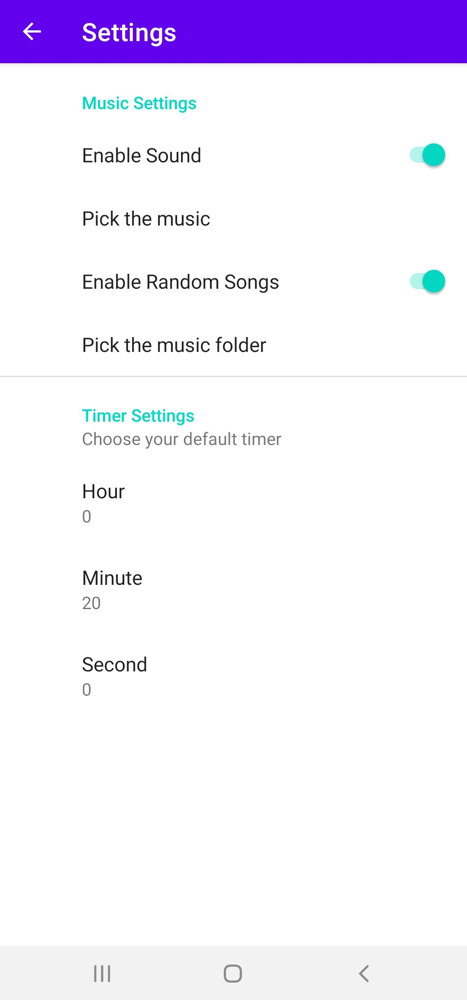

# RandomSongTimer
An Android App that allows user to set random songs for timer.

<!-- TABLE OF CONTENTS -->
## Table of Contents

* [About the Project](#about-the-project)
* [How to Use](#how-to-use)
* [TODO](#to-do)

<!-- ABOUT THE PROJECT -->
## About The Project
This is a personal project, I was searching for a timer app to 
play random songs but didn't find it so I wrote one myself.

<!-- HOW TO USE -->
## How to Use

1) Choose the desired interval using the number pickers

2) Press start to start the timer

3) The timer would notify you when the count down ends

4) You can change the settings by clicking on the settings button
5) By toggling the "Enable Sound" button, you can enable or disable the sound
of the notifications
6) Click "Pick the Music" to choose an audio file as the ringtone of notifications
7) By toggling the "Enable Random Songs" button, you can enable 
or disable playing random songs from the chosen folder
8) Click "Pick the Music Folder" to choose a directory, the app will randomly
choose a song within the folder to play when it notifies you

<!-- TODO -->
## TODO
1) Publish on Google Play Store